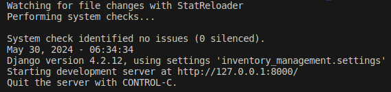

# INVENTORY MANAGEMENT SYSTEM IN DJANGO

## Overview

This is a simple Inventory Management System which is built by using HTML5, CSS, JavaScript and Bootstrap as front-end technologies and Django and Python as back-end technologies.

## Installation
1. Locate to the Directory in which you want to clone this repo.
2. Open terminal by,
    + In Linux systems : By pressing `Ctrl` + `Alt` + `T` keys.
    + In Windows systems : Right mouse click and choose option ***Open in terminal***.
3. Inside terminal Type and run :
```
git clone https://github.com/e9mgund/inventory-management.git
```
4. Run ```cd inventory-management``` to go inside the repository.
5. Ensure that you have created a Virtual Environment , if not then ,
    + In Linux Systems : Run `/usr/bin/python3 -m venv env_name` statement into the Terminal.
    + In Windows Systems : You have to install a python module named ***virtualenv***. To install it run the statement `pip install virtualenv` in terminal. Now run `virtualenv env_name` .
6. Ensure that you have activated the virtual environment, if not then,
    + In Linux Systems : Run `source env_name/bin/activate` .
    + In Windows Systems : Run `env_name\Scripts\activate` .
7. Install all the neccesary requirements by, `pip install -r requirements.txt` .
8. Now run `cd inventory_management` to go inside the project folder.
9. To start the server :
    + In Linux Systems : Run `python3 manage.py runserver` .
    + In Windows Systems : Run `py manage.py runserver` .
10. After the server starts you'll see something like this :

    

    To start the app follow the link.

## Usage

1. After starting the app, it redirects the user to the login page. But first the user has to register himself / herself.
2. By clicking on the *New User* link the user will be redirected to the register page.
3. Register as a new user. While registering keep in mind ,
    + Email address should in standard format, ex. *example@example.com*
    + Password must be atleast 8 characters long.
    + Password must contain atleast 1 character , 1 special character and 1 number.
4. After successful registration the app will redirect the user to the login page.
5. After signing in, the user will be redirected to the Dashboard page of the app.
6. On the dashboard, There is a navbar which contains links for the Dashboard , the data tables and a logout button.
7. The table on the dashboard is 